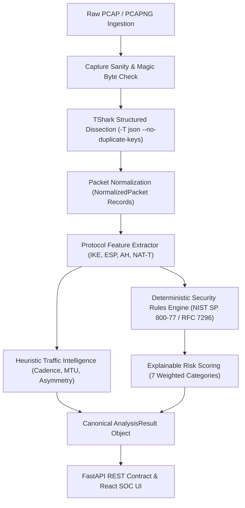

# Real IPsec PCAP Ingestion & Protocol Analysis Pipeline

## 1. Overview & Architecture

AbhedyaX implements a modular, deterministic protocol analysis pipeline that ingests raw IPsec network captures (`.pcap`, `.pcapng`) and produces canonical, evidence-backed security assessments.

The design decouples packet capture dissection from downstream security scoring and visualization, fulfilling the core architectural requirement that the API contract and frontend interface remain identical regardless of whether an analysis originates from the `MockAnalysisEngine` (simulation benchmark) or the `RealAnalysisEngine` (TShark CLI protocol dissection).

---

## 2. Seven-Stage Pipeline Specification

1. **Capture Validation (`validate_capture`):**
   - Validates existence, read permissions, file size limits (`MAX_PCAP_SIZE_MB`), and libpcap / pcapng magic byte signatures (`\xd4\xc3\xb2\xa1`, `\x0a\x0d\x0d\x0a`, etc.).
2. **Environment Inspection (`inspect_environment`):**
   - Verifies the availability of the `tshark` CLI binary in the system PATH.
   - Detects the runtime Wireshark version (e.g. TShark 4.7.3) and active build features.
3. **Structured Dissection (`run_tshark`):**
   - Executes `tshark` with argument arrays using `asyncio.create_subprocess_exec` (`shell=False`).
   - Uses `-T json --no-duplicate-keys` to prevent JSON deserialization collisions on repeated payload transforms.
4. **Packet Normalization (`normalize`):**
   - Converts raw nested TShark JSON packet trees into flat, strongly-typed `NormalizedPacket` records.
5. **Protocol Parameter Extraction (`extract_parameters`):**
   - Dissects IKEv1/IKEv2 exchange types, SPIs, encryption transforms, integrity algorithms, PRF, and Diffie-Hellman groups.
   - Identifies ESP, AH, and UDP-encapsulated NAT-Traversal (port 4500) traffic.
6. **Deterministic Security Assessment (`assess_security`):**
   - Evaluates compliance rules (`IKE-001`, `CRYPTO-001`, `DH-001`, `AUTH-001`, `PFS-001`, `LIFE-001`).
   - Generates transparent, weighted risk scores across 7 discrete security categories.
7. **Canonical Result Generation (`generate_result`):**
   - Synthesizes the final `AnalysisResult` complete with `capture_metadata`, `protocol_observations`, `score_factors`, and packet-level `evidence` references.

---

## 3. Observed Facts vs. Inferred Values

AbhedyaX strictly distinguishes verified cryptographic facts from inferred or unobserved parameters:

| Parameter | Type | Source & Confidence |
|---|---|---|
| **IKE Version** | Observed | Extracted directly from ISAKMP/IKE header major/minor version (Confidence: 1.0). |
| **Transform Suite (ENCR, PRF, INTEG, DH)** | Observed | Decoded from IKE_SA_INIT / Quick Mode proposal attributes (Confidence: 0.95–1.0). |
| **ESP SPI & Sequence Number** | Observed | Dissected from ESP packet header (Confidence: 1.0). |
| **NAT-Traversal** | Observed | Detected via UDP port 4500 and `udpencap` dissector (Confidence: 1.0). |
| **Tunnel vs. Transport Mode** | Inferred | Classified based on endpoint subnet routing and traffic selectors (Confidence: 0.85). |
| **Child SA Re-keying PFS** | Inferred | Checked via presence of independent KE payload in Child SA proposals (Confidence: 0.90). |

---

## 4. Known Limitations & Prototype Boundaries

- **Encrypted Payload Decryption:** AbhedyaX does not require or attempt to decrypt the inner ESP payload. Confidentiality of user traffic is fully respected.
- **Single-File Scope:** The current implementation analyzes one capture at a time per analysis ID.
- **TShark Dependency:** In production, the host environment must have `wireshark-cli` installed. If absent, the backend returns an explicit `503 Service Unavailable` error rather than generating false data.
